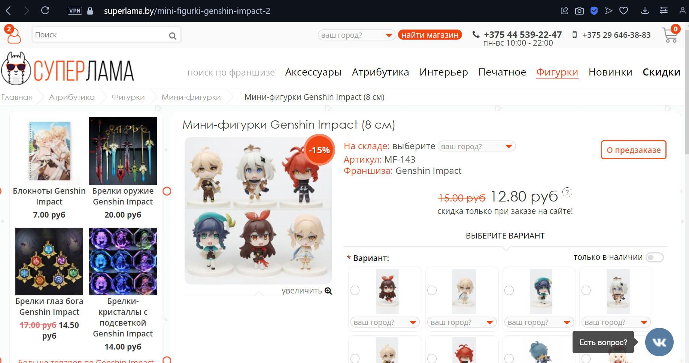
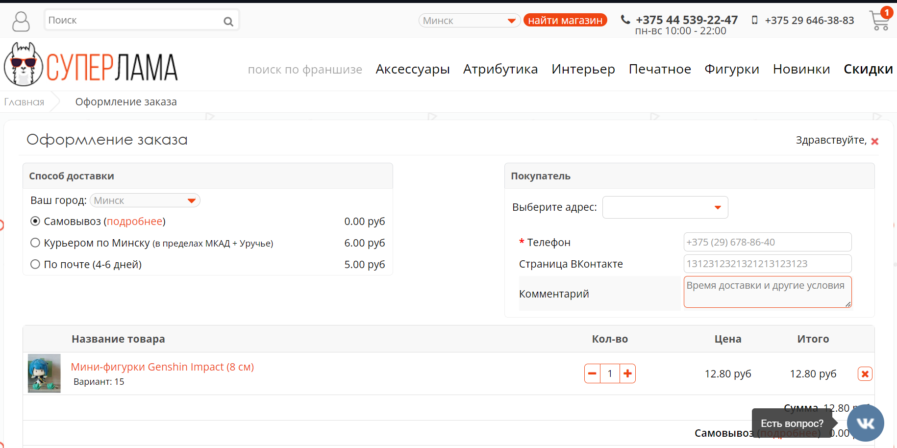

# Lab3_test

site: [https://superlama.by](https://superlama.by/)

| № | Название | Шаги | Ожидаемый результат | Фактический результат | Результат |
| --- | --- | --- | --- | --- | --- |
| 1 | Поиск товара “Мини-фигурки Genshin Impact (8 см)” | 1) Перейти на сайт https://superlama.by/               2) Ввести в поиск значение “Мини-фигурки Genshin Impact (8 см)”      3) Выбрать предложенный вариант     | Переход на страницу с информацией о данном товаре | Произошел переход на страницу с товаром, который я искал. Результат на рисунке 1. | Пройден |
| 2 | Заказать товар, но ввести некорректные данные | 1) Перейти на сайт https://superlama.by/            2) Выбрать любой товар                      3) Добавить в корзину         4) Сделать заказ товара          5) Ввод в поле email несуществующую почту. Ввод в поле ВК не существующий аккаунт  | Заказ будет отменен из-за неверных данных | Заказ подтвержден. Результат на рисунке 2. | Провал |
| 3 | Удаление товара из корзины | 1) Перейти на сайт https://superlama.by            2) Выбрать любой товар      3) Перейти на страницу с товаром                                    4) Добавить товар в корзину два раза                        5) Зайти в корзину                   6) Попробовать удалить один товар из корзины | Из двух одинаковых товаров останется один | За один клик удались два товара                                 До удаления рисунок 3         После удаления рисунок 4 | Провал |
| 4 | Проверка системы фильтрации | 1) Перейти на сайт.               2) Перейти в раздел “Новинки”                                3) Выбрать категорию “Значки”                                     4) Выбрать цену до 20 руб | Останутся товары категории “Значки” ценой до 20 руб | Остались товары категории “Значки”. Цена каждого товара до 20 руб. Результат на рисунке 5. | Пройден |
| 5 | Смена пароля | 1) Перейти на сайт                                         2) Перейти в личный кабинет                                              3) Перейти в раздел пароль                                               4) Ввести новый пароль пробелами “      “ | Будет выведено: “Введен некорректный пароль” | Пароль был изменен. Результат на рисунке 6. | Провал |
| 6 | Добавление контакта | 1) Перейти на сайт              2) Перейти в личный кабинет                                  3) Перейти в раздел “Мои контакты”                   4) Ввести email “dima.gaykov.04gmail.com”                                        5) Ввести ФИО “ГайковДмитрийВикторович”                                       6) Ввести телефон “1111”    7) Ввести вк “d.google.com”   | Оповещение об ошибках во всех полях | Ошибки лишь в полях email и номер телефона. Результат на рисунке 7. | Провал |
| 7 | Поиск за счет URL | 1) Перейти на сайт             2) Перейти в категории “Картины”                                 3) Выбрать фильтр тег “Наруто”                               4) В URL изменить параметр catgory_id на 60  | Появление продуктов из другой аудитории. Навигационное меню показывает выделяет новую категорию | Товары стали для новой категории. Навигационное меню показывает на старую категорию. Результат на рисунке 8. | Провал |
| 8 | Проверка сортировки товаров | 1) Перейти на сайт                     2) Перейти в раздел “поиск по франшизе”                    3) Выбрать категорию “Supernatural”                       4) Выбрать категории “Блокноты” и “Значки”                5) Выбрать режим сортировки “Сначала дорогие” | Появятся товары, цены которых будут по убыванию, плюс ко всему товары будут категорий “Блокноты” и “Значки” | Появились 3 товара, выбранных категорий. Они отсортированы по цене. Результат на рисунке 9. | Пройден |
| 9 | Добавление товара в закладки | 1) Перейти на сайт                  2) Перейти на страницу “Аксессуары”                        3) Перейти на страницу товара “Металлические значки феминизм”                       4) Нажать на сердечко          | В личном кабинете в разделе “Мои закладки” должен появится товар “Металлические значки феминизм” | Товар “Металлические значки феминизм” появился в разделе “Мои закладки”. Результат на рисунке 10 | Пройден |
| 10 | Добавление адреса | 1) Перейти на сайт              2) Перейти в личный кабинет                                  3) Перейти в раздел “Мои адреса”                      4) Ввести следующие данные: ФИО: Гайков Дмитрий Викторович; Город: Хойники; Индекс: 111; Адрес: ул. Ленина, д. 2                                               5) Нажать “Сохранить”       | Должна быть ошибка в поле индекс, так как они требуют 6 цифр | Ошибки нет, адрес сохранен. Результат на рисунке 11 | Провал |

# Рисунок 1 — результат теста 1

# Рисунок 2 — результат теста 2

# Рисунок 3 — до удаления

# Рисунок 4 — после одно клика на крестик

# Рисунок 5 — результата 4 функционально теста

# Рисунок 6 — результата 5 функционально теста(если что, у их так тупо оповещает о смене пароля)

# Рисунок 7 - результат функционального тестирования №6

# Рисунок 8 - результат функционального теста номер 7

# Рисунок 9 - результат функционального теста номер 8

# Рисунок 10 - результат функционального теста номер 9

# Рисунок 11 - результат функционального теста номер 10